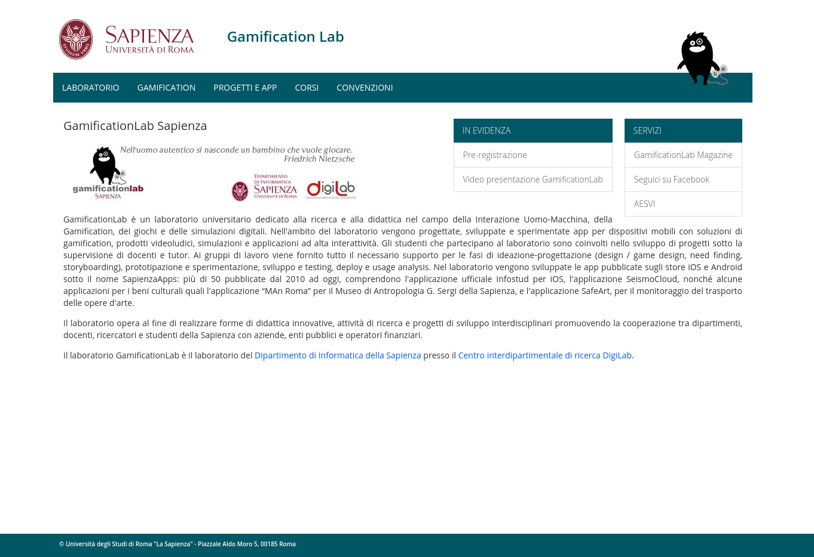

# Hugo theme for Sapienza website (new style)

This theme is a porting of the new template for Sapienza University websites.

All main sections below the header are taken from the first level of `main` menu. All subtrees are drawn in the left menu in the corresponding "section".

In the front-matter you can add a `pagemenu` key with an array of menus to be drawn in the index page (more examples soon).

## Base colors

* `#565249`: Libraries (Biblioteche), SBS
* `#146255`: Research Center (Centro di ricerca)
* `#005866`: Department (Dipartimento)
* `#534F2C`: Museum (Museo)
* `#2B425C`: School (Scuola), Faculty (Facoltà)
* `#822433`: Research/Service center (Centro di ricerca e servizi), Laboratories (Laboratori), CAD, other services

# Requirements

Tested with GoHugo 0.73.0

# License

See `LICENSE` file for template files.

**Please note that this repository contains some images which are subjected to copyright from Sapienza University**: for those (Sapienza logo, font, etc) please see the corresponding regulation at https://www.uniroma1.it/en/pagina/brand-template-and-visual-identity